<p align="center">
  
</p>

<p align="center"><sub>wait for it.</sub></p>

<br>

<p align="center">
  
</p>

<p align="center">
  
</p>

<p align="center">
  
</p>

<br>

<h3 align="center">stack</h3>

<table align="center">
  <tr>
    <td align="right"><b>front</b></td>
    <td></td>
  </tr>
  <tr>
    <td align="right"><b>back</b></td>
    <td></td>
  </tr>
  <tr>
    <td align="right"><b>ops</b></td>
    <td></td>
  </tr>
  <tr>
    <td align="right"><b>tools</b></td>
    <td></td>
  </tr>
</table>

<br>

<h3 align="center">shipping</h3>

<table align="center">
  <tr>
    <td width="440" valign="top">
      <h4><a href="https://github.com/tanaymishra/Auther-frontend">auther</a></h4>
      authentication and user management for organizations, in realtime.
      <br><br><sub><b>TypeScript</b> · auther.ziloris.com</sub>
    </td>
    <td width="440" valign="top">
      <h4><a href="https://github.com/tanaymishra/Reliable-Frontend">reliable</a></h4>
      uptime and monitoring for services that are not allowed to go down.
      <br><br><sub><b>TypeScript</b></sub>
    </td>
  </tr>
  <tr>
    <td width="440" valign="top">
      <h4><a href="https://github.com/tanaymishra/Exebee">exebee</a></h4>
      the long running one. still in it.
      <br><br><sub><b>TypeScript</b></sub>
    </td>
    <td width="440" valign="top">
      <h4><a href="https://github.com/tanaymishra/zyloris-main">zyloris</a></h4>
      everything above, under one roof.
      <br><br><sub><b>TypeScript</b> · <a href="https://ziloris.com">ziloris.com</a></sub>
    </td>
  </tr>
</table>

<br>

---

<details>
<summary><b>how this page works</b></summary>

<br>

no javascript here. github strips `<script>`, `<style>` and every event handler before your
browser sees the file, so this page cannot have a runtime. the SVGs are served under
`default-src 'none'` too, so they cannot pull in a single external asset either.

everything above is therefore drawn or baked at build time.

**the banner** is real 3-D. `build/orb.js` puts 400 particles in perspective space and solves
the full projection for all 48 keyframes ahead of time, shipping them as SMIL value lists. the
browser only interpolates between answers that were already worked out. the reveal is
anamorphic, same trick as the skull in Holbein's *The Ambassadors*: every particle gets a random
depth along its own view ray, then its coordinates are solved backwards so that at yaw zero it
lands on a letterform. the geometry is honest at every angle. exactly one angle is readable.

**the cards** are `build/cards.js`. SVG cannot animate text content, so the counters are not
counters, they are seventeen stacked `<text>` nodes each visible for one slice of an eased ramp.

**the numbers are real**, pulled from the GraphQL API, including the ones that make me look
smaller. 3 public stars. the 93% is `restrictedContributionsCount / contributionCalendar.total`.

```
node build/orb.js
node build/cards.js
```

</details>
