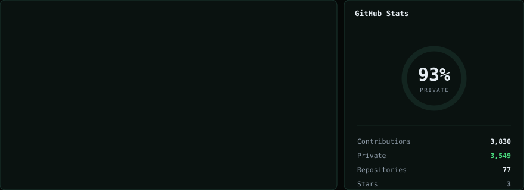
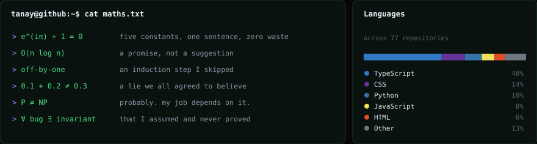
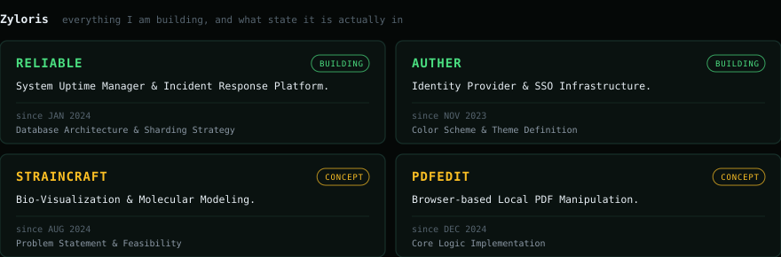

<h1 align="center">Tanay Mishra</h1>

<p align="center">
  Full Stack Developer · building <a href="https://ziloris.com">Zyloris</a><br>
  <sub>locked in since 2021</sub>
</p>

<br>

<p align="center">
  
</p>

<p align="center">
  
</p>

<p align="center">
  
</p>

<br>

<h3 align="center">Zyloris</h3>

<table align="center">
  <tr>
    <td width="440" valign="top">
      <b>RELIABLE</b> &nbsp;<sub>BUILDING · since Jan 2024</sub><br><br>
      System uptime manager and incident response. Monitoring stacks are fragmented: one tool for
      frontend errors, another for server metrics, a third for paging. This is all of it in one place.
      <br><br><sub>Now: multi-region sharding for high-availability event logging.</sub>
    </td>
    <td width="440" valign="top">
      <b>AUTHER</b> &nbsp;<sub>BUILDING · since Nov 2023</sub><br><br>
      Identity provider and SSO infrastructure. Auth0 and Clerk punish growth with per-user pricing.
      You should not have to pay to verify who your own users are.
      <br><br><sub>Now: public beta, SSO and MFA, no per-user pricing.</sub>
    </td>
  </tr>
  <tr>
    <td width="440" valign="top">
      <b>STRAINCRAFT</b> &nbsp;<sub>CONCEPT · since Aug 2024</sub><br><br>
      Bio-visualization and molecular modelling.
      <br><br><sub>Now: problem statement and feasibility.</sub>
    </td>
    <td width="440" valign="top">
      <b>PDFEDIT</b> &nbsp;<sub>CONCEPT · since Dec 2024</sub><br><br>
      Browser-based PDF manipulation that runs entirely on your machine. Nothing is uploaded.
      <br><br><sub>Now: core logic implementation.</sub>
    </td>
  </tr>
</table>

<br>

---

<details>
<summary><b>how this page works</b></summary>

<br>

no javascript. github strips `<script>`, `<style>` and every event handler before your browser
sees the file, and the SVGs are served under `default-src 'none'` so they cannot fetch a single
external asset either. every panel, ring, bar and rule above is drawn at build time.

each row is one SVG rather than a markdown table of separate images, because GitHub adds
unpredictable padding to table cells and that is the only way to control the layout exactly.

**the numbers are real**, pulled from the GraphQL API, including the ones that make me look
smaller. 3 public stars. the 93% is `restrictedContributionsCount / contributionCalendar.total`:
3,549 of 3,830 contributions never appear on the public graph.

**the project statuses are read from the Zyloris source**, not written by hand, so "CONCEPT"
means it is genuinely still a concept.

```
node build/dash.js
```

</details>
