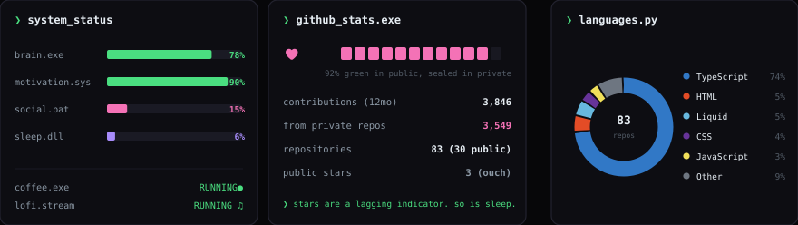
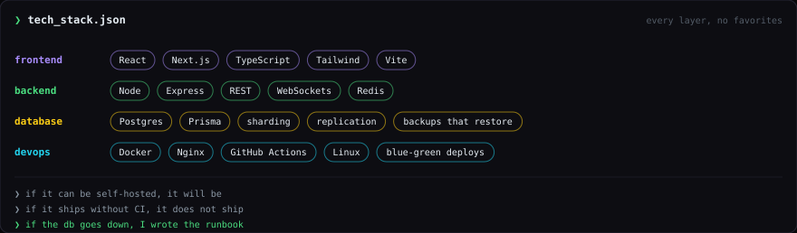
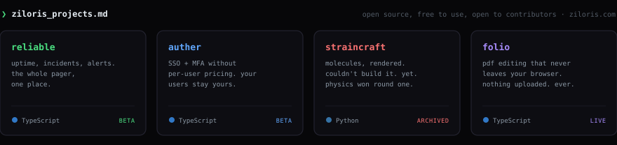
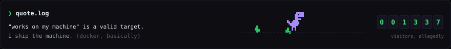

  

  

  

  

  

  <a href="https://ziloris.com"><b>Ziloris</b></a> is not a company. it is an open source, free-to-use software
  initiative I work on full time: uptime without the pager sprawl, auth without per-user pricing, documents that never
  leave your browser. every project above is open to contributions, pick one at
  <a href="https://ziloris.com">ziloris.com</a>.

  

  

